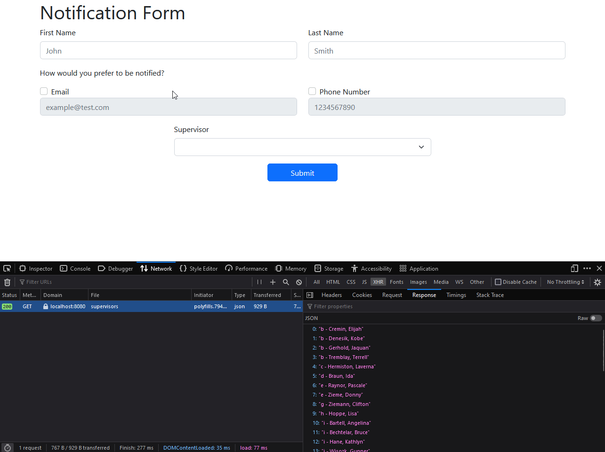
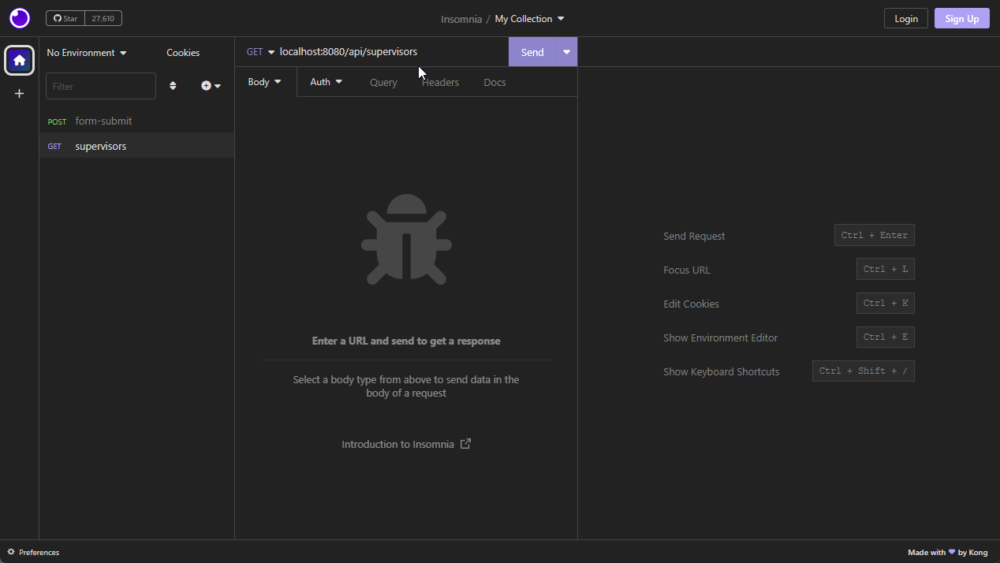
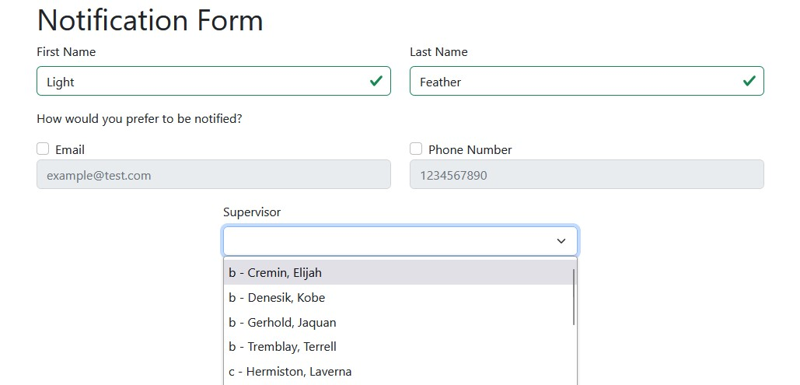
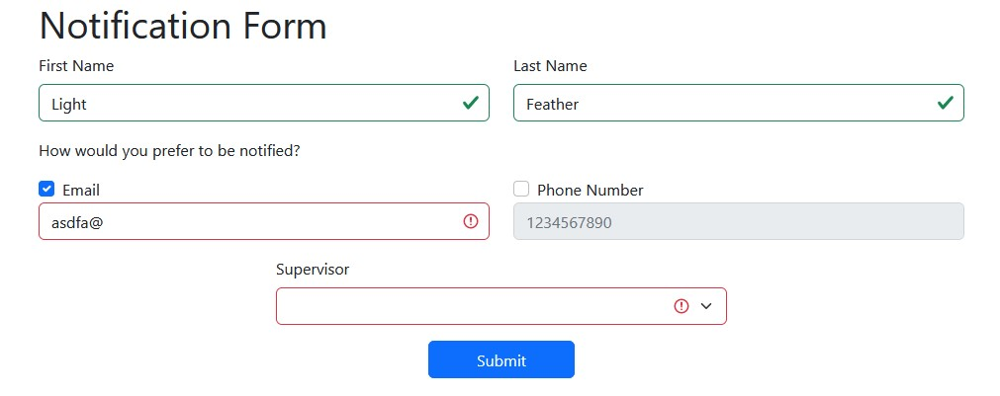

# LightFeather Coding Challenge

## Install and Running

### Step 1: Clone the repository

`git clone https://github.com/weiw11/lightfeather-fullstack.git`

### Step 2: Running Project with docker-compose

```sh
docker compose up
```

> Note: This creates an image for both backend and frontend projects.

To run project specific docker containers, `cd` to `backend/frontend` folder and run `docker compose up`.

## Project Images

Form Demo

API Demo

Form

Validation/Error Handling

